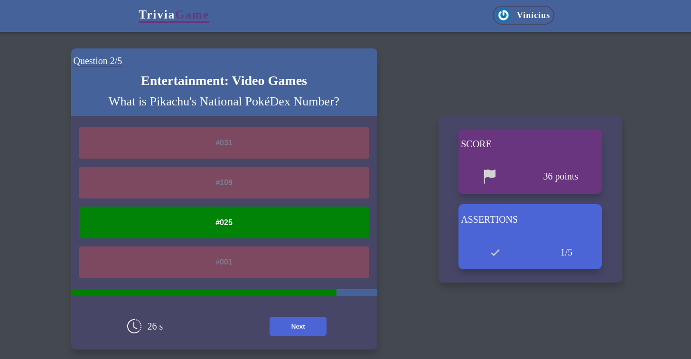
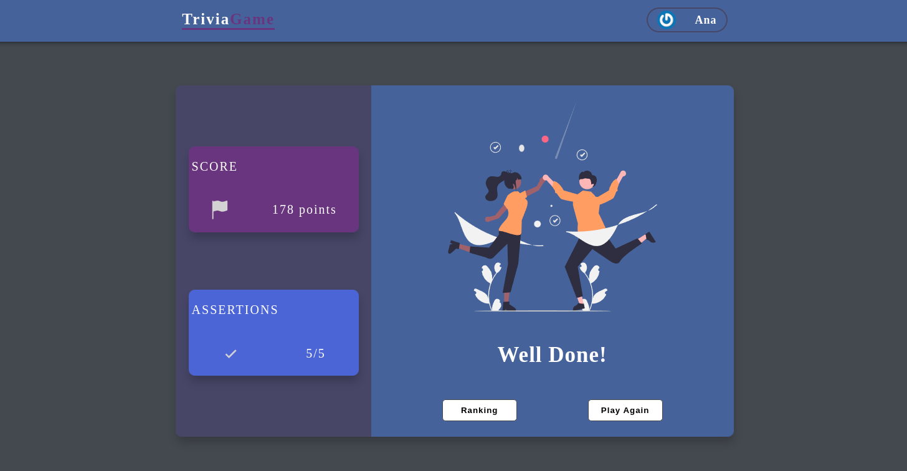
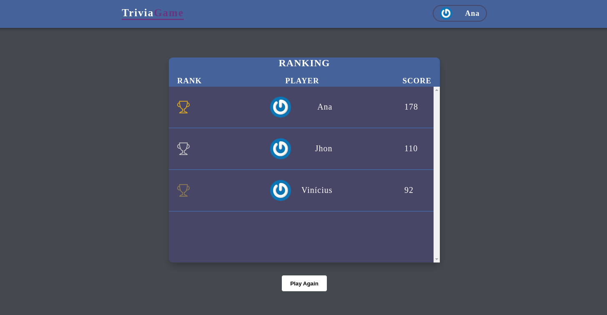

# Trivia Game project

This project was developed during the [Trybe's](https://www.betrybe.com/) Front-end module

## Overview

This project was built with React Redux

Users should be able to:

- Set number of questions, quiz category, difficulty level and question type (multiple choice or boolean).
- Log into the game and, if the email is registered on Gravatar's website, have their photo associated with the user profile.
- Access the game's page, where you must choose one of the available answers for each of the questions presented. The answer must be marked before the time counter reaches zero, otherwise the answer will be considered wrong.
- After the game is over, view feedback with your performance.
- View a ranking with the scores of all players.

### Demo
- [Live project](https://viniciuslacerda-trivia-game.vercel.app/)

### Screenshots

### Local usage
- Clone this repo;
- Access the local repository folder;
- run $ npm install 
- run $ npm start
